# GUI-Based Multi-Client Chat Application Using TCP

This repository contains Assignment 6 of the ISEA Phase 3 Cybersecurity Internship at Tezpur University. The project extends the terminal-based TCP chat application from Assignment 5 into a graphical desktop application using Python Tkinter, while preserving the original server-side networking logic and TCP-based communication workflow.

## Author

- **Name:** Jitupan Mondal
- **Roll Number:** EEB24023
- **Institution:** Tezpur University
- **Program:** B.Tech in Electrical Engineering
- **Internship:** ISEA Phase 3 Cybersecurity Internship

## Objective

The objective of this assignment is to convert the previously developed terminal-based multi-client TCP chat application into a GUI-based desktop application. The implementation reuses the Assignment 5 server with minimal modification, keeps networking logic independent from GUI code, and supports background message handling so the interface remains responsive during communication.

## Assignment Requirements Covered

This implementation satisfies the following major requirements:

- Reuse of the existing `server.py` with minimal changes.
- GUI-based client implementation using Tkinter widgets such as `Tk`, `Frame`, `Label`, `Entry`, `Button`, `Listbox`, `ScrolledText`, and `messagebox`.
- Login window with username validation.
- Main chat interface with message display, input box, Send button, Disconnect button, and connection flow.
- Online user list with automatic updates.
- Support for both broadcast and private messaging.
- Background thread for incoming messages to keep the GUI responsive.
- Testing in Mininet using one server and four clients with `sudo mn --topo single,5`.
- Traffic verification using Wireshark filter `tcp.port == 5000`.

## Features

- Graphical login window with validation against empty usernames.
- Scrollable chat display using Tkinter `ScrolledText`.
- Message input box with Send button and Enter-key based sending.
- Disconnect button for graceful client termination.
- Automatically updated online user list using `/list` synchronization.
- Broadcast message support to all connected users.
- Private messaging using `/msg <username> <message>` format.
- Join and leave notifications from the server.
- Background receiving thread with `queue.Queue` and `root.after()` polling for thread-safe GUI updates.
- Server-side logging through `chat_history.csv` and `server_log.txt`.

## Project Structure

```text
EEB24023_JITUPAN-MONDAL_ASSIGNMENT6/
├── screenshots/
│   ├── wireshark_captures/
│   │   ├── broadcast_packet.png
│   │   ├── disconnect_packet.png
│   │   ├── private_message_packet.png
│   │   └── tcp_handshake.png
│   ├── login_window_with_error.png
│   ├── login_window.png
│   ├── broadcast_message.jpeg
│   ├── online_users_list_filled.png
│   ├── private_message.jpeg
│   ├── successful_connection.png
│   └── user_leaving.jpeg
├── chat_history.csv
├── client_gui.py
├── server_log.txt
└── server.py
```

## System Details

The project was developed and tested in the following environment:

- **OS:** Linux `jitupan-mondal-QEMU-Virtual-Machine` `7.0.0-22-generic` (Ubuntu, aarch64)
- **Python Version:** 3.14.4
- **Network Interface:** `enp0s1`
- **Host IP Address:** `192.168.64.2/24`

## Software Requirements

- Python 3.14.4
- Tkinter
- Mininet
- Wireshark or tcpdump
- Ubuntu Linux environment
- A system capable of running multiple client windows

## Network Topology

The required Mininet topology for this assignment is:

```bash
sudo mn --topo single,5
```

This creates one server host and four client hosts connected through a single switch.

| Host | Role        | IP Address | Test Username |
| ---- | ----------- | ---------- | ------------- |
| h1   | Chat Server | 10.0.0.1   | —             |
| h2   | Client 1    | 10.0.0.2   | Amit          |
| h3   | Client 2    | 10.0.0.3   | Priya         |
| h4   | Client 3    | 10.0.0.4   | Rahul         |
| h5   | Client 4    | 10.0.0.5   | Sneha         |

## Implementation Overview

The project follows a client-server model over TCP sockets.

### Server Side

The `server.py` file was reused from Assignment 5. It listens on port 5000, accepts multiple client connections, stores active users, supports both broadcast and private messaging, sends join/leave notifications, and records logs to `chat_history.csv` and `server_log.txt`.

### Client Side

The GUI client is implemented in `client_gui.py` using three main classes:

- **`NetworkClient`**: Handles socket creation, connection, sending messages, receiving messages, and disconnect logic.
- **`LoginWindow`**: Displays the initial login form and validates the username before connection.
- **`ChatWindow`**: Displays the main chat interface, online users list, message entry box, and controls for sending or disconnecting.

### Thread-Safe GUI Handling

The networking thread receives messages in the background and places them into a `queue.Queue`. The Tkinter GUI checks this queue periodically using `root.after()` and updates the interface safely from the main thread. This prevents the GUI from freezing during blocking socket operations.

## Execution Steps

### 1. Start Mininet

```bash
sudo mn --topo single,5
```

### 2. Verify connectivity

Inside the Mininet CLI:

```bash
mininet> pingall
```

### 3. Start the server

Run the server on host `h1`:

```bash
mininet> h1 python3 server.py &
```

To confirm the server IP address if needed:

```bash
mininet> h1 ifconfig
```

### 4. Start packet capture

To capture traffic for Wireshark verification:

```bash
mininet> h1 tcpdump -i h1-eth0 -w capture.pcap tcp port 5000 &
```

### 5. Launch clients

Run the GUI client for four users. If GUI forwarding inside Mininet is inconvenient, the GUI can be launched from the Ubuntu desktop or host environment while connecting to `10.0.0.1`.

```bash
python3 client_gui.py
```

Launch four client windows and log in with:

- Amit
- Priya
- Rahul
- Sneha

### 6. Perform the test sequence

Use this order during demonstration:

1. Open the login window.
2. Attempt a blank username to trigger validation.
3. Log in four users one by one.
4. Send a broadcast message.
5. Send a private message using `/msg Priya Hi Priya, This is a private message`.
6. Disconnect one client and observe the leave notification and updated user list.

### 7. Verify packets in Wireshark

Open the capture file and apply:

```text
tcp.port == 5000
```

Verify and capture screenshots for:

- TCP handshake
- Broadcast message packet
- Private message packet
- Disconnect packet

## Test Evidence

The completed run produced both broadcast and private message logs in `chat_history.csv`.

```text
timestamp,sender,receiver,message_type,message
22:52:08,Amit,ALL,broadcast,Hello everyone
23:01:10,Amit,Priya,private,"Hi Priya, This is a private message"
```

The `server_log.txt` file confirms client joins and disconnections during testing.

```text
22:39:24,CONNECTED,Amit,10.0.0.2
22:40:30,CONNECTED,Priya,10.0.0.3
22:40:37,CONNECTED,Rahul,10.0.0.4
22:40:43,CONNECTED,Sneha,10.0.0.5
22:47:57,DISCONNECTED,Sneha,10.0.0.5
```

## Sample Screenshots

### Login Window

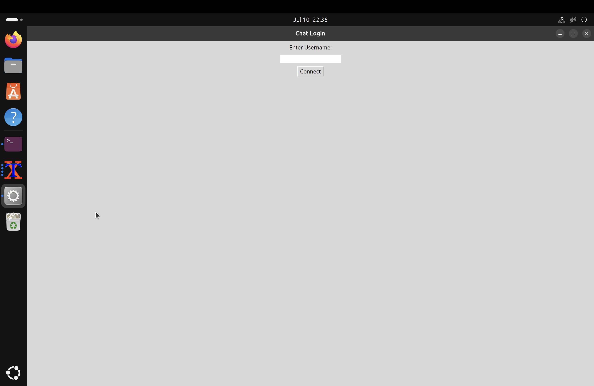

### Login Validation Error

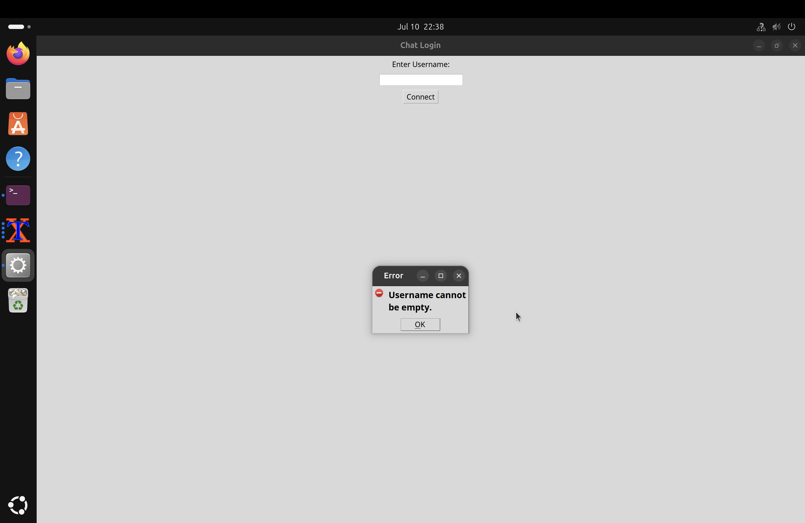

### Successful Connection

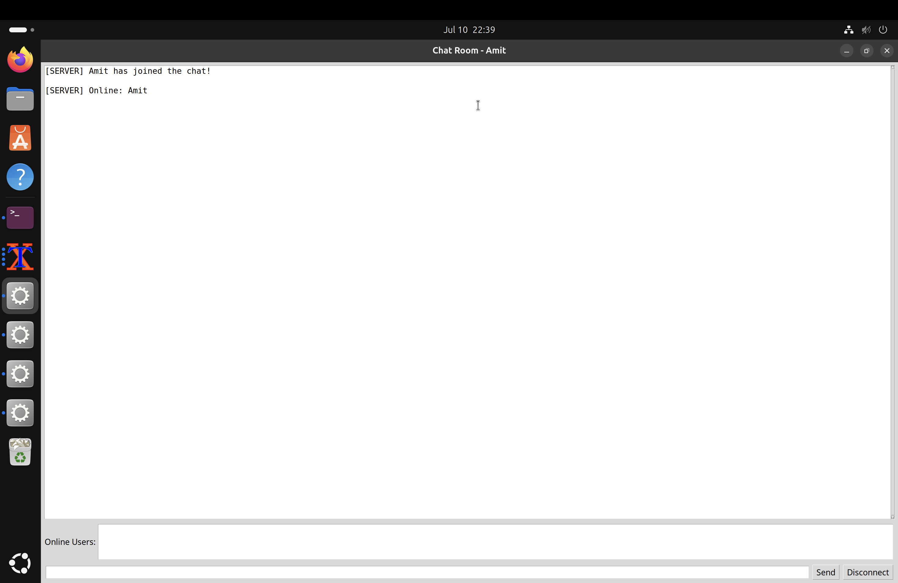

### Online Users List

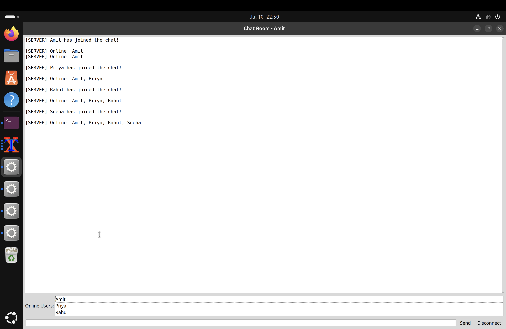

### Broadcast Message

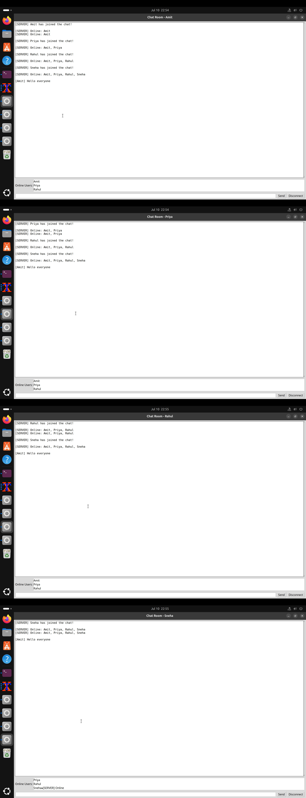

### Private Message

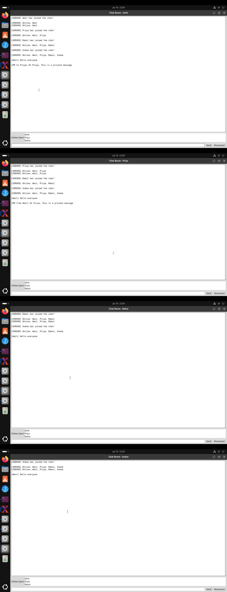

### User Leaving

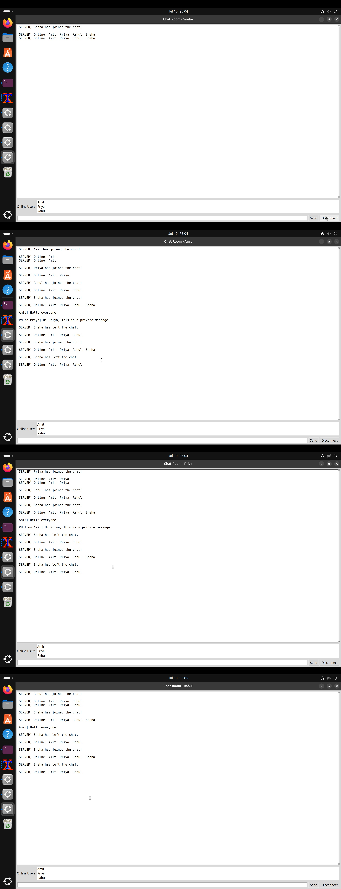

### TCP Handshake

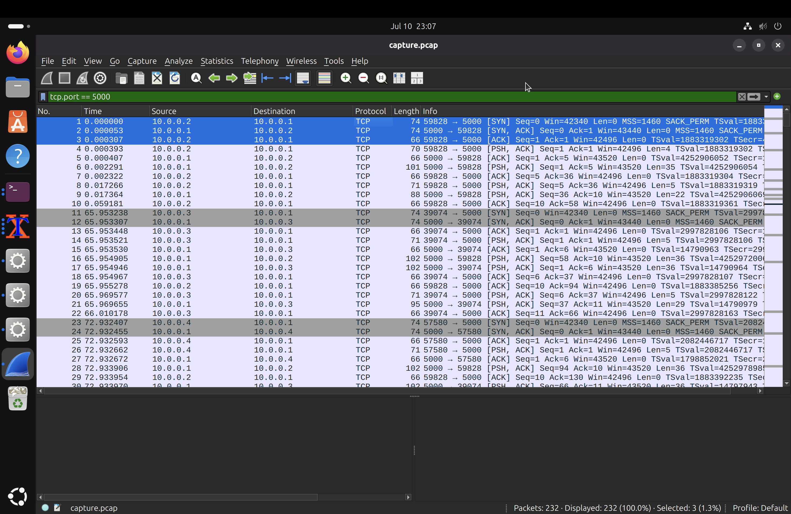

### Broadcast Packet

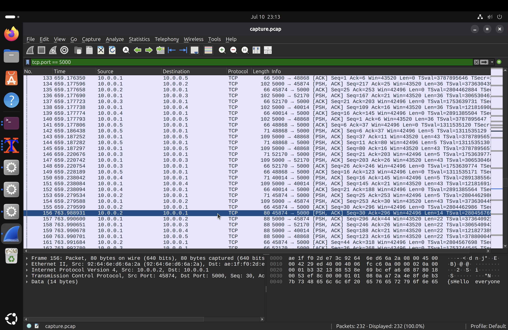

### Private Message Packet

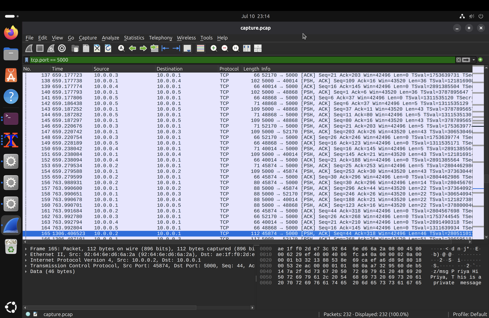

### Disconnect Packet

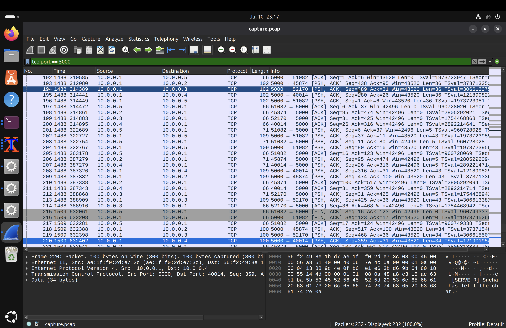

## Learning Outcomes

This assignment provided practical experience in:

- designing a TCP-based client-server application,
- converting terminal interaction into a GUI-based desktop workflow,
- using multithreading safely in GUI applications,
- testing applications in a Mininet environment,
- and validating transport-layer communication using Wireshark.

## Conclusion

This project successfully transforms a terminal-based chat application into a GUI-based multi-client TCP chat system while preserving the original server logic. The implementation demonstrates socket programming, Tkinter GUI development, background-thread-based message reception, Mininet testing, and Wireshark-based verification in a clean and functional cybersecurity internship assignment workflow.
